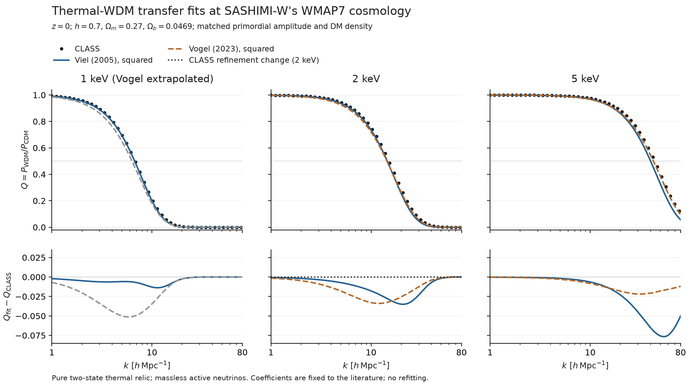

# WMAP7でのWDM伝達関数の独立検証

**WMAP7でもVogel & Abazajian (2023)の係数は5 keVで改善するが、
2 keVでは指標によって優劣が変わる。現行Wの全質量域を一律に置換する
根拠にはならない。** 1 keVは同論文の較正範囲外であり、外挿の診断として扱う。

この比較は、既存のViel係数を保持してq10へ統一した後の、追加の係数更新を
判断するために実施した。q10、すなわち伝達振幅を二乗してパワーに適用する
関係は維持している。実行前に[条件と評価指標](PLAN.md)を固定し、
今回のCLASS結果に係数をフィットする操作は行っていない。

## 宇宙論と規格化

SASHIMI-Wの既存入力ファイルのヘッダーから、
`Omega_b=0.0469, Omega_m=0.27, h=0.7, n_s=0.95, sigma8=0.82`を読み取った。
物理密度は`omega_b=0.022981, omega_dm=0.109319`である。
CLASSのCDMとWDMでこれらの背景条件を揃え、Viel・Vogel式にも同じ
`h`と暗黒物質密度を代入した。Viel式の密度引数は`Omega_WDM`、
Vogel式は`omega_WDM=Omega_WDM*h^2`である。

CDMのみの試行で原始振幅を決め、以後は全計算で
`A_s=2.3637375865030362e-9`を共用した。CDMのCLASS出力は
`sigma8=0.82`となった。WDMを別途`sigma8=0.82`へ再規格化していない。
WDMは2内部自由度・化学ポテンシャル0の熱的Fermi–Dirac分布で、
各質量の温度を現在の暗黒物質密度に合わせた。

平坦宇宙、質量ゼロのactive neutrino `N_ur=3.046`、
`T_cmb=2.7255, tau_reio=0.0544`は以前のCLASS比較と同じ条件に固定した。
これらの放射・再電離設定は元のSASHIMI入力ヘッダーに残っていないため、
元のCAMB計算の全設定・パワーテーブルを完全再現したという意味ではない。
Vogel論文の`m_nu=0.06 eV`を含む設定の完全再現でもない。

## 結果

以下は`z=0`。各列の近似式は、**同じCLASSのパワー半減波数**で評価した。
ここで半減とは`Q=P_WDM/P_CDM=0.5`であり、SASHIMI-W APIの既定の
振幅半減`T=0.5`（`Q=0.25`）とは区別する。

| WDM質量 | CLASSの半減波数 [h/Mpc] | Viel q10のQ | Vogel q10のQ |
|---|---:|---:|---:|
| 1 keV | 6.78034 | 0.49319 | 0.45009（質量範囲外） |
| 2 keV | 15.06832 | 0.47112 | 0.46802 |
| 5 keV | 43.98953 | 0.42936 | 0.48029 |

最大誤差は、計算した波数範囲内でCLASSが`0.05 <= Q <= 0.95`を満たす点の
`max |Q_fit-Q_CLASS|`。**Qそのものの絶対差であり、相対誤差の百分率ではない。**
半減波数の誤差は`k_fit/k_CLASS - 1`を百分率で示す。

| WDM質量 | Viel 最大絶対誤差 | Vogel 最大絶対誤差 | Viel 半減波数誤差 | Vogel 半減波数誤差 |
|---|---:|---:|---:|---:|
| 1 keV | 0.01380 | 0.05123（質量範囲外） | −0.906% | −6.759%（質量範囲外） |
| 2 keV | 0.03501 | 0.03388 | −3.755% | −4.409% |
| 5 keV | 0.07654 | 0.02192 | −8.839% | −2.751% |

5 keVは`k=80 h/Mpc`でも`Q=0.10665`なので、`Q=0.05`までの遷移全体は
含まない。表の最大誤差は実際に計算した範囲に限る。1・2 keVでは遷移全体を含む。
`z=99`でも、5 keVでは新係数で改善し、2 keVでは指標によって優劣が変わるという
結論は同じだった。全数値は[比較データ](comparison.json)に保存した。



上段はパワー比、下段はCLASSとの差。1 keVのVogel式は灰色の破線で外挿と明記した。
2 keV下段の黒点線は計算精度を変更したときの差であり、統計的な信頼区間ではない。
[ベクトル形式の図](comparison.pdf)も保存した。

## 以前のPlanck近傍の比較との関係

以前は`h=0.6736, omega_b=0.02237, omega_dm=0.12, n_s=0.9649`に揃えていた。
その結果を今回のCLASSスペクトルと混ぜず、独立した比較として保持した。

| WDM質量 | 以前のViel 最大絶対誤差 | 以前のVogel 最大絶対誤差 | 今回のViel | 今回のVogel |
|---|---:|---:|---:|---:|
| 2 keV | 0.0309 | 0.0186 | 0.0350 | 0.0339 |
| 5 keV | 0.0713 | 0.00994 | 0.0765 | 0.0219 |

CLASS自身の半減波数も、以前の宇宙論からWMAP7に変えると、1・2・5 keVで
それぞれ約−2.36%、−2.23%、−2.08%変わった。したがって宇宙論の変更は
実際に結果へ反映されている。新係数の残差が増えたことも、今回の条件で
直接確認された結果である。ただし複数の背景条件を同時に変更しているため、
残差変化をhや密度のどれか一つに帰属させた検証ではない。

Vogelの宇宙論依存はPlanck 2018近傍で較正されており、WMAP7はその範囲を外れる。
この比較はWMAP7という特定点での性能を測ったもので、宇宙論全域にわたる
フィットの再較正や精度保証ではない。[原論文の較正条件](https://arxiv.org/pdf/2210.10753)

## 数値精度と実装の確認

2 keVのCDM・WDM両方で積分精度と波数・多重極の解像度を上げた結果、
`z=0`の最大絶対Q変化は`2.874e-4`、半減波数の相対変化は`0.01927%`だった。
`z=99`ではそれぞれ`2.960e-4`、`0.01876%`だった。
どちらも事前の基準（最大絶対Q変化0.001未満、半減波数変化0.1%未満）を満たす。
これは2 keVでの精度確認であり、全質量で同じ誤差上限を証明したものではない。

独立に記述したViel式と現在のSASHIMI-Wのパワー比は、1・2・5 keVの全検査点で
絶対差`1.0e-15`以下で一致した。CLASSが返すWDMの現在の密度は目標値と
相対差`2.1e-13`以内で一致した。補間をCubicSplineからPCHIPに変えたときの
最大絶対Q差は、全質量・両赤方偏移で`6.7e-5`未満だった。

パワースペクトルを生成する計算には警告はない。背景密度だけを求める試行には、
使わない出力波数・赤方偏移指定に関する警告があり、その内容も保存した。
[実装・密度・警告の確認結果](quality-checks.json)

保存した生出力から別の出力先へ解析を再実行し、比較JSONと保存スペクトルが
バイト単位で一致することも確認した。これは解析の再現確認であり、CLASSを
独立に再実行した回数を増やしたという意味ではない。
[再解析のハッシュ比較](reproducibility.json)

## 採用に関する判断

- 5 keVでは、同じWMAP7条件でもVogel係数へ変える根拠が得られた。
- 2 keVでは改善は一様でなく、半減波数では現行Viel式の方が近い。
- 1 keVはVogelの較正範囲外であり、今回の外挿も現行Viel式より悪化した。
  現行APIの既定質量1.5 keVも、Vogelの公表された質量較正範囲を下回る。

したがって、今回の結果から係数を全域で自動置換する判断はしていない。
質量によって近似式を切り替える新しい処方も、未検証のため導入していない。
さらに広い質量範囲で精度を揃えるなら、同じ宇宙論のCLASSスペクトルを直接使う
経路、または目的の範囲で別途較正する方法が次の検討対象となる。

サブハロー数、濃度・EPS模型、潮汐進化、観測上の質量制限は今回再検証していない。
この結果をそれらの精度保証や新しい質量制限として使うことはできない。

## 出典と再現

- Viel et al. (2005), Phys. Rev. D 71, 063534, Eqs. (4), (6), (7):
  [arXiv:astro-ph/0501562](https://arxiv.org/abs/astro-ph/0501562)
- Vogel & Abazajian (2023), Phys. Rev. D 108, 043520, Eqs. (7)–(9), Table II:
  [DOI:10.1103/PhysRevD.108.043520](https://doi.org/10.1103/PhysRevD.108.043520)
- CLASS v3.3.4, source revision
  `e85808324f51fc694d12e3ed7439552a3c3f9540`:
  [固定ソース](https://github.com/lesgourg/class_public/tree/e85808324f51fc694d12e3ed7439552a3c3f9540)

比較用コードの係数のそばにも文献、式番号、密度の定義、単位、較正範囲を記載した。
再実行はリポジトリ直下から以下を使用する。`CLASS_BIN`は上記ソースから
ビルドした実行ファイル、`CLASS_SOURCE_MANIFEST`はその出典JSON、
`PREVIOUS_COMPARISON`は以前の`class-comparison.json`を指す。
Python環境にはNumPy・SciPy・Matplotlibが必要で、今回の版は比較JSONと
[描画メタデータ](render-metadata.json)に記録した。

```sh
python scripts/run_wmap7_class_validation.py \
  --class-executable "$CLASS_BIN" --class-source-manifest "$CLASS_SOURCE_MANIFEST" \
  --output review-artifacts/wmap7-transfer-new-run --masses 2 1 5
python scripts/run_wmap7_class_validation.py \
  --class-executable "$CLASS_BIN" --class-source-manifest "$CLASS_SOURCE_MANIFEST" \
  --output review-artifacts/wmap7-transfer-new-run --masses 2 --precision fine
python scripts/analyze_wmap7_class_validation.py \
  --raw review-artifacts/wmap7-transfer-new-run \
  --output /tmp/wmap7-transfer-new-analysis --previous-comparison "$PREVIOUS_COMPARISON"
python scripts/check_wmap7_class_validation.py \
  --raw review-artifacts/wmap7-transfer-new-run \
  --output /tmp/wmap7-transfer-new-analysis/quality-checks.json
python scripts/plot_wmap7_class_validation.py /tmp/wmap7-transfer-new-analysis
```

今回の生出力は`review-artifacts/wmap7-transfer-20260911/`に保存した。
各CLASS実行の入力と出力ハッシュは[comparison.json](comparison.json)に含まれる。
[spectra.npz](spectra.npz)には生のk・P配列と比較用のQ配列を保存した。
既存のCLASS入力・完了結果は上書きせず、再利用時にはハッシュを検証する。
